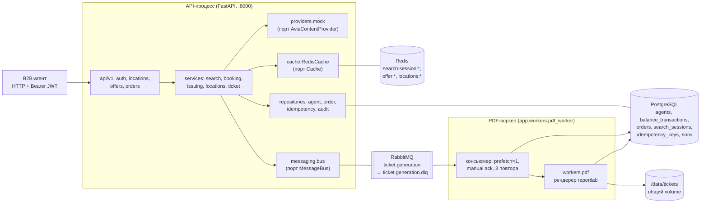
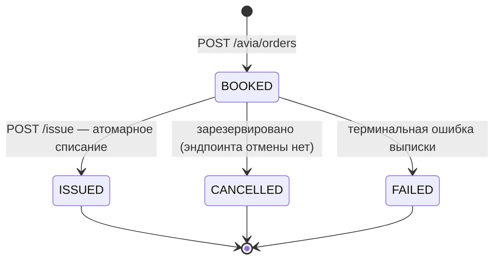

# Архитектура

Техническое описание устройства сервиса: компоненты, поток бронирования, стейт-машина заказа, механика атомарности и идемпотентности, гексагональные границы.

## Компоненты

Два долгоживущих процесса — `api` (uvicorn) и `worker` (консьюмер RabbitMQ) — плюс три stateful-зависимости. PDF-каталог — общий volume, поэтому файл, записанный воркером, сразу отдаётся API.



Ключевые решения:

- **Фоновый поиск внутри API-процесса.** Поиск запускается как `asyncio`-таск в том же процессе (без отдельной очереди): провайдер вызывается с дедлайном `SEARCH_DEADLINE_SECONDS`, результат пишется в Redis и PostgreSQL. Это сознательный компромисс: поиск — дешёвая CPU-операция поверх мока, а очередь оправдана только там, где работа тяжёлая и терять её нельзя (PDF).
- **Отказоустойчивость по принципу fail-open.** Недоступный Redis — просто cache-miss (API работает прямо из PG/провайдера); недоступный RabbitMQ — публикация возвращает `False` и (при `TICKET_FALLBACK_SYNC=true`) PDF рендерится синхронно в API-процессе; аудит-запись, которую не удалось сохранить, только логируется. Ни одна из этих деградаций не ломает основной поток.
- **Публикация после коммита.** Задача на PDF публикуется строго после `COMMIT` транзакции выписки — брокер недоступен ⇒ выписка всё равно успешна.

## Стейт-машина заказа



Разрешённые переходы заданы в `app/domain/enums.py` (`ALLOWED_ORDER_TRANSITIONS`); `ISSUED`, `CANCELLED`, `FAILED` — терминальные. Через API реально выполняется переход `BOOKED → ISSUED`; каждая смена фиксируется в `order_status_history` (from/to/reason/actor). Воркер PDF статус не меняет — он только заполняет `ticket_file` / `ticket_generated_at`.

## Поток бронирования

```mermaid
sequenceDiagram
    autonumber
    actor Ag as Агент
    participant API as API (FastAPI)
    participant Pr as Provider (mock)
    participant RD as Redis
    participant PG as PostgreSQL
    participant MQ as RabbitMQ
    participant W as PDF-воркер

    Ag->>API: POST /travel/avia/offers {origin, destination, departure_date}
    API->>Pr: search_locations (валидация IATA-кодов, 422 при неизвестном)
    API->>PG: INSERT search_sessions (PENDING, expires_at)
    API->>RD: SET search:session:{id} (TTL 900 c)
    API-->>Ag: 202 {search_id, status: "pending"}
    API->>Pr: search_offers (background task, дедлайн 30 c)

    loop Поллинг (items пуст до готовности)
        Ag->>API: GET /travel/avia/offers/search/{id}
        API->>RD: GET search:session:{id}
        API-->>Ag: 200 {status: "pending", items: []}
    end

    Pr-->>API: список офферов
    API->>RD: snapshot: status=done + offers
    API->>PG: UPDATE search_sessions (done, items_found)
    Ag->>API: GET /travel/avia/offers/search/{id}
    API-->>Ag: 200 {status: "done", items: [...]}

    Ag->>API: GET /travel/avia/offers/{offer_id}
    API->>RD: GET offer:{offer_id} — промах
    API->>Pr: get_offer_detail (таймаут 8 c)
    API->>RD: SET offer:{offer_id}
    API-->>Ag: 200 OfferDetail (fare_families, fare_rules, offer_expires_at)

    Ag->>API: POST /travel/avia/orders + Idempotency-Key
    API->>PG: claim ключа (INSERT ... ON CONFLICT DO NOTHING → LOCKED)
    API->>PG: детали оффера; INSERT orders + passengers + history; COMMIT
    API->>PG: complete ключа (COMPLETED, код 201, тело ответа)
    API-->>Ag: 201 OrderOut (status BOOKED)

    Ag->>API: POST /travel/avia/orders/{id}/issue + Idempotency-Key
    API->>PG: claim ключа (LOCKED)
    API->>PG: BEGIN; SELECT agent FOR UPDATE; SELECT order FOR UPDATE
    API->>PG: balance -= total; INSERT balance_transactions (DEBIT);<br/>order → ISSUED; ticket_number; INSERT history; COMMIT
    API->>PG: complete ключа (COMPLETED, тело IssueOut)
    API->>MQ: publish {order_id, ticket_number} (persistent, confirm)
    API-->>Ag: 200 IssueOut {debited_amount, balance_after, ...}
    Note over API,MQ: брокер недоступен → sync-генерация PDF в API-процессе (TICKET_FALLBACK_SYNC)

    MQ->>W: доставка ticket.generation
    W->>PG: SELECT order + passengers (свежая сессия)
    W->>W: рендер PDF → запись через .tmp + os.replace (атомарно)
    W->>PG: UPDATE orders (ticket_file, ticket_generated_at); COMMIT
    W->>MQ: ack

    Ag->>API: GET /travel/avia/orders/{id}/ticket
    API-->>Ag: 202 {"status": "generating"} + Retry-After: 2
    Ag->>API: GET /travel/avia/orders/{id}/ticket
    API-->>Ag: 200 application/pdf
```

Сценарии деградации поиска: провайдер не уложился в дедлайн → сессия `failed` с `error="provider_timeout"`; воркер-таск погиб, не завершившись → при очередном поллинге сессия старше `SEARCH_DEADLINE_SECONDS + 5` лениво помечается `failed` (`error="deadline_exceeded"`); TTL сессии истёк → `404 SEARCH_EXPIRED`.

## Атомарность выписки

Выписка (`app/services/issuing.py`) — единственное место, где меняется баланс агента. Гарантии:

1. **Порядок блокировок: сначала агент, потом заказ.** Обе строки берутся `SELECT ... FOR UPDATE` в детерминированном глобальном порядке — конкурентные выписки разных заказов одним агентом сериализуются на строке агента, дедлоки невозможны. Чтение агента использует `populate_existing`, чтобы под блокировкой увидеть актуальный баланс, а не кэш identity map (строка уже могла быть загружена auth-зависимостью).
2. **Одна транзакция.** Списание баланса, вставка в ledger, смена статуса на `ISSUED`, присвоение `ticket_number` и запись в `order_status_history` коммитятся атомарно — либо всё, либо ничего.
3. **Ledger как страховка.** `balance_transactions` имеет `UNIQUE(order_id, txn_type)` — даже при ошибке выше по коду второй `DEBIT` по тому же заказу упадёт на ограничении БД. Баланс по соглашению меняется только вместе со вставкой соответствующей ledger-строки (инвариант зафиксирован в комментарии модели `BalanceTransaction`).
4. **Деньги — только `Decimal`.** Колонки `Numeric(14, 2)`, округление `ROUND_HALF_UP` до цента; ни один денежный аргумент не проходит через float. В JSON деньги сериализуются строками: `f"{value:.2f}"` для балансов/списаний, `format(decimal, "f")` для цен офферов.
5. **Побочные эффекты — после коммита.** Публикация задачи на PDF выполняется уже после `COMMIT` в режиме best-effort: падение брокера или рендера не превращает успешную выписку в ошибку.

Проверки до списания (в той же транзакции, под блокировками): заказ принадлежит агенту (иначе 403), статус `BOOKED` (иначе 409 `INVALID_ORDER_STATUS`), валюта заказа совпадает с валютой счёта (иначе 409 `CURRENCY_MISMATCH`), баланс покрывает сумму (иначе 402 `INSUFFICIENT_FUNDS` с `details` {order_amount, balance}).

## Идемпотентность

Хранилище — таблица `idempotency_keys` с `UNIQUE(agent_id, scope, key)`; claim выполняется атомарным `INSERT ... ON CONFLICT DO NOTHING`. Scope: `create_order` (хэш — sha256 канонического JSON тела) и `issue` (хэш — sha256 строки `issue:{order_id}`). Повтор с другим payload под тем же ключом не может «воспроизвести» чужой ответ.

| Состояние ключа | Сценарий | Поведение |
|---|---|---|
| — (первый запрос) | claim успешен | ключ → `LOCKED`, запрос обрабатывается |
| `LOCKED` | параллельный запрос с тем же ключом | `409 IDEMPOTENCY_IN_PROGRESS` |
| `COMPLETED`, хэш совпал | повтор после успеха | сохранённое тело + исходный код (201/200) + заголовок `Idempotency-Replayed: true` |
| `COMPLETED`, хэш другой | ключ переиспользован с другим payload | `409 IDEMPOTENCY_KEY_REUSED` |
| `FAILED` | ошибка исходной попытки | ключ перезанимается — клиент может повторить попытку |
| `LOCKED` навсегда | краш процесса между claim и complete/fail | все повторы получают 409 до ручной очистки (TTL-политика — в проде) |

Ошибки бизнес-логики намеренно помечают ключ `FAILED` (например, 402 при нехватке средств), чтобы клиент мог повторить после пополнения баланса тем же ключом.

Помимо ключа, выписка идемпотентна «естественно»: повторный `POST .../issue` уже-ISSUED заказа (даже без заголовка) под блокировкой видит статус `ISSUED` и возвращает `IssueOut`, пересчитанный из текущего состояния, — без второго списания. Гарантия reinforced ограничением `UNIQUE(order_id, txn_type)` на ledger.

## Гексагональная архитектура

Бизнес-логика (`app/services/**`) зависит только от протоколов из `app/domain/ports.py` (`@runtime_checkable Protocol`):

| Порт | Назначение | Прод-адаптер | Тестовый/альтернативный |
|---|---|---|---|
| `AviaContentProvider` | локации, поиск, детали оффера | `MockAviaProvider` (`app/providers/mock.py`) | `InMemory`-фейки в тестах; будущий `http`-адаптер |
| `Cache` | JSON-кэш с TTL | `RedisCache` (`app/cache.py`) | `InMemoryCache` |
| `MessageBus` | публикация задач (PDF) | `RabbitMessageBus` (`app/messaging/bus.py`) | sync-фолбэк генерации |

Доменные сущности (`app/domain/entities.py`) — замороженные pydantic-модели, не знающие ни FastAPI, ни SQLAlchemy; сериализация между слоями (провайдер → Redis → JSONB-снапшот заказа) выполняется через `model_dump(mode="json")`.

### Замена мока на реальный GDS

1. Реализовать класс с `name` и методами `search_locations`, `search_offers`, `get_offer_detail` (httpx уже в зависимостях; `PROVIDER_BASE_URL` и `PROVIDER_TIMEOUT_SECONDS` уже в конфиге).
2. Зарегистрировать его в фабрике `app/providers/__init__.py::get_provider` (сейчас `PROVIDER=http` намеренно падает с понятной ошибкой).
3. Бизнес-логика поиска, кэширования, аудита (`provider_call_logs`) и валидации не меняется: orchestration-слой уже оборачивает вызовы провайдера в таймауты и пишет аудит каждого вызова.
